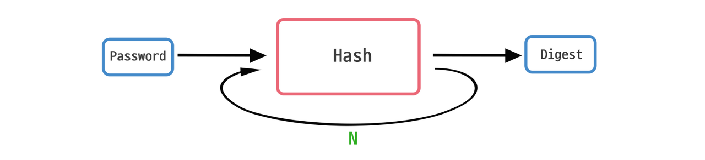
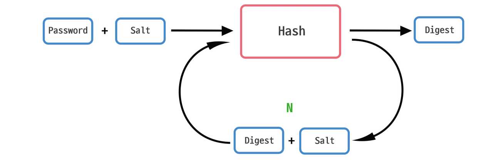

# EnjoyTrip

### 대전 7반 6팀

### 프로젝트 개요

- 지역별 관광지를 지도에 보여주고 관광지의 분류별로 필터링하여 원하는 관광지를 쉽게 찾을 수 있도록 돕는다.
- 지역별 추천 코스를 보여주는 기능을 추가 할 예정.
- 마음에 든 코스나 관광지를 저장하여 따로 관리하는 기능 추가 예정.

### 화면구성

- 메인
- 로그인
- 회원가입
- 관광지 상세 및 리뷰 조회
- 사용자정보 조회
- 사용자정보 수정

### 메인화면


- 메인화면에서 원하는 지역을 선택하면 해당 지역으로 맵을 이동학고 맵에 마커로 관광지를 표시한다.


- 줌 아웃 상태에서는 마커를 클러스터링하여 표시하고, 줌 인을 하면 각 관광지를 분류에 따라 마커로 표시한다.


- 분류를 선택하면 분류에 해당하는 마커만 지도에 표시하고 해당하는 관광지들을 카드형태로 메인화면에 표시한다.
- 해당 카드를 클릭하면 상세 페이지로 이동한다.

### 로그인


- 기본적인 로그인 기능을 구현한 로그인 화면

### 회원가입


- 기본적인 회원가입 기능을 구현한 회원가입 화면

### 상세화면


- 각 관광지의 상세 정보를 표시한다.

### 리뷰 등록 및 조회


- 각 관광지에 대한 리뷰를 남긴다.

### 회원정보 조회


- 현재 로그인한 사용자 본인의 회원정보를 조회한다.
- 수정 및 삭제 기능을 사용할 수 있다.

### 회원정보 수정


- 회원정보를 수정하는 페이지이다.
- 수정 후 회원정보가 정상 적용된다.

---

<br/>
<br/>
<br/>
<br/>
<br/>
<br/>
<br/>

# 알고리즘 적용

---

```java
    기본 기능(아래의 2가지 중 1개 선택), 70점
        알고리즘 2개 기능 구현 - (O | X), 구현한 알고리즘 기능에 대한 기획서 제출
        페이징 또는 댓글을 구현한 게시판 - (O | X), 어떤 게시판을 구현 했는지 명시
        ex> 리뷰 게시판(페이징), 자유 게시판(댓글)

    추가 기능(구현 기능 없이 아이디어 작성 - 최대 2개)
        추가 알고리즘 및 기획서(개당 15점) - (O | X)
```

---

# 🔐 Bcrypt를 활용한 개인정보 암호화 송신

## 개요

Bcrypt는 Salting 및 Key Stretching을 적용한 단방향 해시 알고리즘이다.


### 해시 알고리즘과 약점

단방향 암호화에 사용되는 해시 알고리즘은 동일한 문자열에 대해 항상 동일한 해시값을 갖기 때문에, 빠른 시간 안에 모든 해시값을 무차별로 대입하여 시스템이 갖고 있는 해시값을 찾아내는 레인보우 테이블 활용 공격에 취약하다는 단점이 있다.
(\*레인보우 테이블 : 해커들이 여러 값을 대입해보며 얻었던 거의 모든 해시값이 저장된 테이블)

이러한 약점을 보완하기 위해 해싱 알고리즘에는 일반적으로 **Salting** 및 **Key Stretching**이 적용된다.

### Salting

Salting(솔팅)이란 해시 알고리즘을 적용하기 전, 원래의 데이터에 랜덤한 임의의 데이터를 덧붙히는 작업을 뜻한다.
이렇게 솔팅을 한 후 해시 알고리즘을 적용하면 공격자가 레인보우 테이블을 사용하여 해시값을 알아내게 되어도 원문 데이터를 알아내는 것은 거의 불가능에 가깝게 된다.
사용자 별로 다른 Salt를 사용하여 솔팅을 진행하면 효과는 더 좋다. 한 사용자의 정보가 유출되어도 다른 사용자의 정보 유출에는 거의 영향이 없기 때문이다.


### Key Stretching

Key Stretching(키 스트레칭)이란 해시 알고리즘을 적용하여 암호화 한 데이터에 또 해시 알고리즘을 적용하여 암호화하는, 암호화 작업을 여러 번 반복하는 작업을 뜻한다.



키 스트레칭은 단순히 해시 알고리즘을 여러 번 반복하는 작업이기 때문에 똑같이 레인보우 테이블로 해시값을 알아내는 작업을 반복하면 다소 쉽게 풀린다는 단점이 있지만, 상술한 Salting와 함께 적용한다면 복호화 하는 데에 상당한 용량과 시간이 소요되어 보안성이 굉장히 향상되기 때문에 솔팅과 함께 자주 사용된다.



## 적용 현황

### 회원가입

BCrypt 클래스의 hashpw 함수와 gensalt 함수를 사용해
사용자가 회원가입 시 입력한 원문 비밀번호에 Salting을 한 후 해싱 알고리즘을 돌려 복잡한 비밀번호를 생성한다.

```java
public boolean regist(UserDto user) throws SQLException {

	**String encryptedPass = BCrypt.hashpw(user.getUserPass(), BCrypt.gensalt());
	user.setUserPass(encryptedPass);**

	return userDao.regist(user);
}
```

DB에는 원문 비밀번호가 아닌, 이렇게 암호화되어 생성된 복잡한 비밀번호가 저장된다.


회원가입 화면 - 회원가입 시 원문 비밀번호로 ‘qwer’를 입력했다.


유저 테이블 정보 - DB에 원문 비밀번호가 아닌, 암호화된 비밀번호가 저장됨을 알 수 있다.

### 로그인

사용자가 로그인 시 입력한 ID 정보와 일치하는 ID를 가진 사용자 정보를 DB에서 불러오고,
해당 사용자 정보의 비밀번호 정보(암호화되어 있음)가 로그인을 시도한 사람이 입력한 비밀번호 정보를 암호화한 것이 맞는지 checkpw 함수를 사용하여 확인한다.

```java
public UserDto login(String userId, String userPass) throws SQLException {
	try(
			Connection con = db.getConnection();
			PreparedStatement stmt = con.prepareStatement(
					"select user_id, user_pass, user_name, join_date, email_id, email_domain "
				+ "from users "
				+ "where user_id = ? "
			)
		) {
			int idx = 1;
			stmt.setString(idx++, userId);

			ResultSet rs = stmt.executeQuery();
			if(rs.next()){
				UserDto user = new UserDto();

				user.setUserId(rs.getString("user_id"));
				user.setUserPass(rs.getString("user_pass"));
				user.setUserName(rs.getString("user_name"));
				user.setJoinDate(rs.getString("join_date"));
				user.setEmailId(rs.getString("email_id"));
				user.setEmailDomain(rs.getString("email_domain"));

				**if(!BCrypt.checkpw(userPass, user.getUserPass()))
					return null;**

				return user;

			}
		} catch(Exception e) {
			e.printStackTrace();
			return null;
		}

	return null;
}
```


로그인 실패 - 정답 비밀번호인 ‘qwer’이 아닌 틀린 비밀번호를 입력할 시 로그인이 불가하다.


로그인 성공 - 정답 비밀번호 ‘qwer’를 입력할 시 로그인이 가능하다.

---

# 🔍 KMP 알고리즘을 사용한 관광지 검색

## 개요

현재까지 API요청에 대한 결과로 지도에 추가된 마커들의 목록에서 특정 키워드로 검색하여 결과 값을 나열하고 결과값을 클릭하면 해당 관광지의 마커로 지도를 이동한다.

## 설명

### 구현 화면


검색어를 입력하면 해당 검색어를 포함하고 있는 관광지의 목록을 나열한다.

### 구현 코드

```jsx
mapSearchInput.addEventListener("keyup", () => {
  let keyword = mapSearchInput.value;

  let mapSearchResult = document.querySelector(".map-search-result");
  mapSearchResult.innerHTML = "";

  Array.from(markerSet.entries()).forEach((pair) => {
    let value = pair[1];
    let pi = getPi(keyword);
    if (kmp(value.title, keyword, pi) < 0) return;
    let result = document.createElement("li");
    result.innerText = value.title;

    result.addEventListener("click", () => {
      map.setCenter(new naver.maps.LatLng(value.lat, value.lng));
      map.setZoom(17);
    });

    mapSearchResult.appendChild(result);
  });
});
```

“key up”이벤트를 사용해 사용자의 입력이 끝나면 현재까지 AJAX 통신을 사용해 가져온 관광지의 목록에서 해당되는 관광지들을 찾는다.

찾은 관광지들을 목록으로 나열하고 클릭하면 지도에서 해당 좌표로 이동한다.

### 문자열 매칭 구현 코드 - KMP

```jsx
function getPi(pattern) {
  let n = pattern.length;
  let pi = Array.from({ length: n }, () => 0);
  let j = 0;
  for (let i = 1; i < n; i++) {
    while (j > 0 && pattern[i] != pattern[j]) j = pi[j - 1];
    if (pattern[i] == pattern[j]) pi[i] = ++j;
  }

  return pi;
}

function kmp(src, pattern, pi) {
  if (src.length < pattern.length) return -1;

  let n = src.length;
  let j = 0;
  for (let i = 0; i < n; i++) {
    while (j > 0 && src[i] != pattern[j]) j = pi[j - 1];
    if (src[i] == pattern[j]) {
      if (j == pattern.length - 1) return i;
      j++;
    }
  }

  return -1;
}
```

문자열 매칭 알고리즘은 KMP를 사용하였다.

하나의 pattern 문자열에 여러 src 문자열을 비교하기 때문에 getPi 함수를 사용해 한번 pi 배열을 생성하고 그 후 kmp 함수에 인자로 전달하여 사용한다.

---

# ❤️찜 목록 컨텐츠 기반 필터링을 활용한 추천 시스템

## 개요

컨텐츠 기반 필터링은 여러 가지 추천 시스템 중 사용자가 과거에 좋아했던 컨텐츠와 비슷한 유형의 컨텐츠를 추천하는 시스템이다.

나와 같은 컨텐츠를 좋아하는 타 사용자들이 좋아하는 컨텐츠를 추천해주는 협업 기반 필터링은 타 사용자에 기반하기 때문에 이용자 수가 충분하지 않을 경우 시스템이 제대로 시행되지 않는다는 단점이 있기 때문에 컨텐츠 기반 필터링 시스템을 적용하고자 한다.

## 설명

### 자카드 유사도


자카드 유사도(Jaccard Similarity)를 사용해 데이터 베이스에 저장되어 있는 관광지 간의 유사도를 계산하여 테이블에 저장한다.

자카드 유사도를 계산할 때 관광지의 지역과 관광지 분류를 사용해 계산한다.

다른 관광지와의 자카드 유사도를 모두 계산하고 유사도가 가장 높은 관광지를 특정 개수만큼 테이블에 저장한다.

### 유사도를 사용한 관광지 추천


사용자가 저장한 관광지에 저장되어 있는 관련 관광지들 유사도 관광지들을 모두 불러온 후에 유사도가 높은 관광지의 등장 횟수를 계산한다.

계산 횟수가 많은 관광지들이 사용자의 선호도가 높은 관광지라 판단하고 추천 탭에 표시한다.

추후에 사용자가 리뷰에서 관광지별로 해쉬태그를 추가하는 기능을 추가하면 관광지의 자카드 유사도를 계산할 때 더 유의미한 값을 가질 수 있을 것이라 생각한다.
